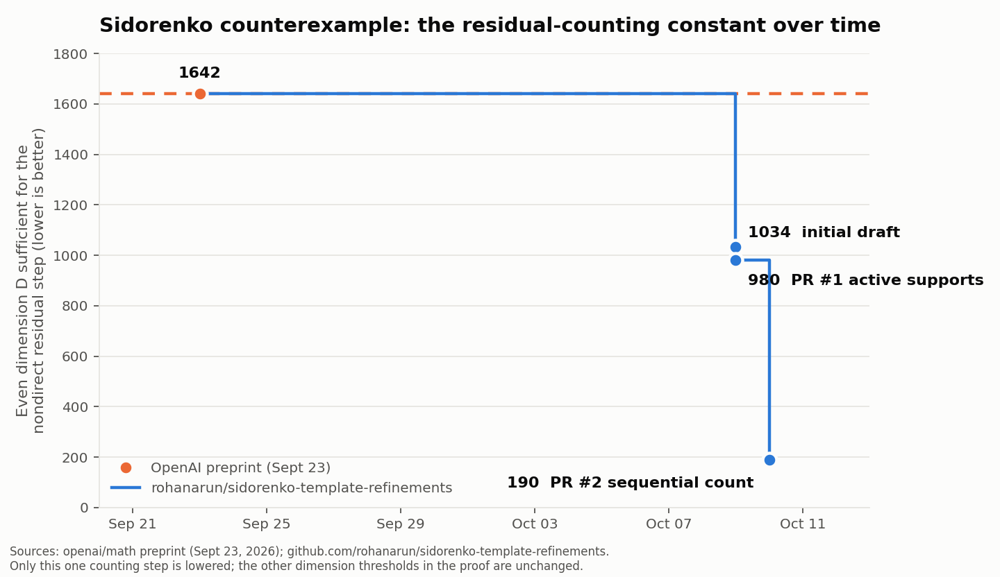

# Progress on the residual-counting constant

The quantity tracked is the even dimension $D$ that suffices for the one
nondirect residual counting step in OpenAI's Sidorenko construction
(Lemma "Costs for the remaining profiles"). Lower is better. Only this
step is lowered; the other dimension thresholds in the proof are unchanged.

| Date | Source | Remainder | Even $D$ sufficient | Method |
|---|---|---:|---:|---|
| 2026-09-23 | OpenAI preprint, pinned commit `fd4aeeb` | 1641 | 1642 | all 33 pairs, free two-spaces in the global span |
| 2026-10-09 | this repository, initial draft | 1032 | 1034 | 28 allowed pairs, greedy/convex local caps |
| 2026-10-09 | this repository, PR #1 | 978 | 980 | active vertex supports |
| 2026-10-10 | this repository, PR #2 | 189 | 190 | sequential basis count with orthogonality |

Regenerate the chart with `python3 charts/make_progress_chart.py`
(requires matplotlib; not part of the certificate runner).

## Tweet draft for PR #2 (explain-like-I'm-25)

> OpenAI's Sidorenko counterexample has one counting step that needed the
> ambient dimension D to be above 1641. We just cut that constant to 189.
>
> The trick: the paper counts each "pair space" as a free 2-dim subspace of
> the global span, then pays for containing it in a Lagrangian. But the
> paper's own direct-sum case already does something smarter: place basis
> vectors one at a time, and each new vector must be symplectically
> orthogonal to everything already at either endpoint. Run that same count
> for the non-direct case, track per vector whether it's new globally and
> new at each endpoint, and the containment cross terms cancel exactly.
> What's left is the overlap of two endpoint spans, which averages to
> Σ deg² − 3m + 11 = 189 on the 28-pair graph.
>
> 1642 → 1034 → 980 → 190 (even D for this one step). Exhaustive audit over
> 55,173 strata agrees; CI reruns it. Scope: one step of one proof, not a
> smaller counterexample. Chart + proof + code:
> github.com/rohanarun/sidorenko-template-refinements
